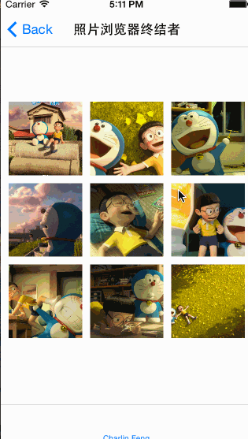
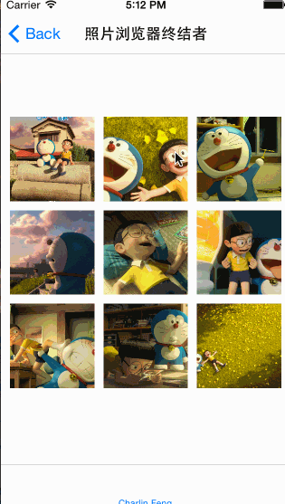
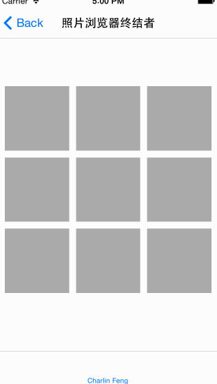
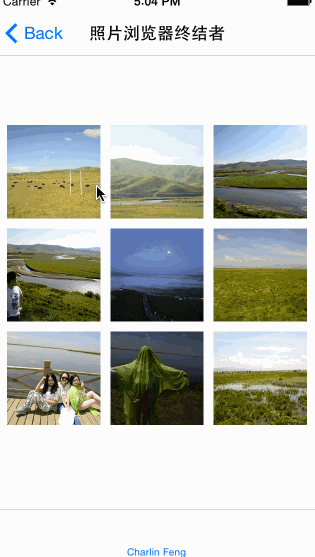

  
###[English Document](https://github.com/nsdictionary/PhotoBrowser/edit/master/README.md)
   
照片浏览器终结者
===============
 
.Swift 1.2  
.Xcode 6.3

 
####本框架包比较大，你最好现在先开始下载。不然你可能会等很久。
##### Charlin Feng作为国内较早使用Swift开发框架和企业正式项目的开发者，诚开Swift专业群，欢迎加入纯Swift学习交流平台我们共进退：
##### QQ群号: 467237044
##### 感谢charlin 3群 @Simn 提供的英文翻译帮助!

 
### （一）总体说明
1.本框架有OC版本，本次主要是汲取了OC版本所有bug与不足，同时听取在大量使用者的反馈与心声、修复与极大的改善了之前的OC版本并在此基础之上精心推出的Swift完美版，https://github.com/nsdictionary/CorePhotoBrowserVC。 
2.纯swift支持，本地与网络支持，横竖屏支持，iPhone所有屏幕支持，iPad平板也支持并力求零Bug。 
3.依赖框架说明：CFSnapKit（布局库）、Haneke（图片缓存库）、NVActivityIndicatorView（加载视图） 
4.本次的文档会比较有趣，是以图片各功能来讲述的，请认真查看图片说明文字，使用也内嵌在这些图片说明中。 
5.本框架基本是在我去若尔盖大草原上的长途汽车途中完成的，所以里面有大量若尔盖风景！ 
6.不支持pod。 

   
快速集成
===============

  
###  1.添加库
拖拽PhotoBrowser文件夹到你的项目，拖拽Frameworks中的依赖库到您的项目中。

  
###  2.展示相册：分本地相册和网络相册

 
#### 2.1展示本地相册

/** 本地相册 */
func showLocal(index: Int){
    
    
    let pbVC = PhotoBrowser()
    
    /**  设置相册展示样式  */
    pbVC.showType = showType
    
    /**  设置相册类型  */
    pbVC.photoType = PhotoBrowser.PhotoType.Local
    
    //强制关闭显示一切信息
    pbVC.hideMsgForZoomAndDismissWithSingleTap = true
    
    var models: [PhotoBrowser.PhotoModel] = []
    
    let title = langType == LangType.Chinese ? titleLocalCH : titleEN
    let desc = langType == LangType.Chinese ? descLocalCH : descLocalEN
    
    //模型数据数组
    for (var i=0; i<9; i++){
        
        let model = PhotoBrowser.PhotoModel(localImg:UIImage(named: "\(i+1).jpg")! , titleStr: title, descStr:desc[i], sourceView: displayView.subviews[i] as! UIView)
        
        models.append(model)
    }
    /**  设置数据  */
    pbVC.photoModels = models
    
    pbVC.show(inVC: self,index: index)
}

 
#### 2.2展示网络相册

/** 网络相册相册 */
func showHost(index: Int){
    
    
    let pbVC = PhotoBrowser()
    
    /**  设置相册展示样式  */
    pbVC.showType = showType
    
    /**  设置相册类型  */
    pbVC.photoType = PhotoBrowser.PhotoType.Host
    
    //强制关闭显示一切信息
    pbVC.hideMsgForZoomAndDismissWithSingleTap = true
    
    var models: [PhotoBrowser.PhotoModel] = []
    
    let titles = langType == LangType.Chinese ? titleHostCH : titleHostEN
    let descs = langType == LangType.Chinese ? descHostCH : descHostEN
    
    //模型数据数组
    for (var i=0; i<9; i++){
        
        let model = PhotoBrowser.PhotoModel(hostHDImgURL: hostHDImageUrls[i], hostThumbnailImg: (displayView.subviews[i] as! UIImageView).image, titleStr: titles[i], descStr: descs[i], sourceView: displayView.subviews[i] as! UIView)
        models.append(model)
    }
    
    /**  设置数据  */
    pbVC.photoModels = models
    
    pbVC.show(inVC: self,index: index)
}

  
####本地相册和网络相册不同点总结如下： 
1.照片浏览器属性showType：本地相册是枚举值Local,网络相册是枚举值Host 
2.照片浏览器的相册模型是PhotoBrowser.PhotoModel类型，他有两个初始化方法： 
本地相册请调用初始化方法PhotoBrowser.PhotoModel(localImg:...， 
网络相册请调用初始化方法PhotoBrowser.PhotoModel(hostHDImgURL:...这个方法。

   
### 3.功能详解（图文使用，请认真查看）：

 
#### (1) 基本展示
##### 可以直接展示照片浏览器，且可指定page显示.
之前我看过的几乎所有的照片浏览器基本都是直接添加在window上的，这样做最简单但有致命缺陷就是设置旋转之后，window上的照片浏览器并不知道。所以我在这里更改了传统做法。照片浏览器初始化传入的vc，请传当前业务控制器即可，不要乱传其他的比如navigationVC，tabarVC哦。。 
 

 

#### (2) 无NavBar，无TabBar
照片浏览器是隐藏了状态栏的，在ios7下状态栏是基于Cotroller管理的，但这个不方便我操作，所以你需要在info.plist文件中加一个属性：View controller-based status bar appearance 并将值设置为NO。 
 

 
#### (3) 有NavBar，无TabBar
 

 
#### (4) 无NavBar，有TabBar
有TabBar的情况下尤为要注意：因为照片浏览器是添加在vc之上的（能自动旋转，并在设计上是合理的），所以您的vc最好是全屏布局的，就是说最好不要使用vc.edgesForExtendedLayout，否则你可能会发现您的照片浏览器不是全屏的大小。 
 

 
#### (5) 有NavBar，有TabBar
 

 
#### (6) Push模式
#####请直接设置pbVC.showType = PhotoBrowser.ShowType.Push  
#####Push模式界面已经自定义，统一了界面 
 

 
#### (7) Modal模式
#####请直接设置pbVC.showType = PhotoBrowser.ShowType.Modal  
##### 界面已经自定义
 

 
#### (8) 放大模型：仿网易新闻，经典OC版本模式
#####请直接设置pbVC.showType = PhotoBrowser.ShowType.ZoomAndDismissWithCancelBtnClick  
#####仿网易效果为：单击不会退出，但会切换隐藏或显示详细信息。  
##### 单击：显示详细信息
##### 再单击：隐藏详细信息并进入全屏深度查看模式，此模式下无pageControl
 

 
#### (9) 放大模式：微信、新浪微博缩放模式
#####大家在OC版本反馈想要的功能，，经典OC版本无此功能 
#####请直接设置pbVC.showType = PhotoBrowser.ShowType.ZoomAndDismissWithSingleTap  
#####仿微信效果为：单击不会切换详细信息，而是直接就退出。  
##### 注：此模式下可定制详细信息显示模式，下面会写到。
 
 

#### (10) 横屏功能支持：大家在OC版本反馈想要的功能
##### 横屏模式可兼容iPad，并可竖进竖出、竖进横出、橫进橫出、橫进竖出。
##### 进：指的是点击缩略图进入照片浏览器；出：指的是退出照片浏览器。
 

 
#### (11) 图片保存
##### 图片做了重复保存逻辑，但下一次再次进入照片浏览器还是可以再次保存
##### OC版本做了严密的仿重复保存处理，不过代价略高。
##### 注：我看了微信、微博也是一样的，下次进入还是可以重复保存，所以不纠结

 

 
#### (12) 信息滚动查看：大家在OC版本反馈想要的功能
##### 请注意查看第2页详细文字过少因而不能滚动，而第1页文字过多，是可以上下滚动查看的
##### 注：文字过少不可滚动。文字过多可直接滚动，可选中文字。
 

 
#### (13) 单击模式：详细信息模式
##### 有标题以及具体的详细说明文字信息
##### 注：默认为显示详细信息，单击退出模式下此功能可定制，请参见下一个示例
 

 
#### (14) 单击模式：去除详细信息模式，仿微信
#####这个是大家在OC版本反馈想要的功能 
##### 无标题以及详细文字，但有pageControl
请设置以下代码，注意此功能仅仅在ZoomAndDismissWithSingleTap下有效

//强制关闭显示一切信息
pbVC.hideMsgForZoomAndDismissWithSingleTap = true

 

 
#### (15) 缩略图未加载成功，大图也没有加载成功
##### 默认使用动态生成的黑色图片缩放
swift中的图片缓存框架Haneke目前不支持下载进度，所以没有图片下载进度，其他有进度的框架又是只支持ios8以上。不过我在Haneke的issue中请教了如果获取进度，不过作者还没有回复我。如果有了进度功能，我会尽快添加进度指示。 
 

 
#### (16) 缩略图加载成功，大图没有加载成功
##### 缩略图动态到照片浏览器正中间120*120缩略图占位状态
 

 
#### (17) 缩略图加载成功，大图也加载成功
#### 缩略图直接缩放到高清大图计算后的位置占位状态
 

 
#### (18) 缩略图加载成功，图片查看中下载成功及动画
##### 由缩略图占位动态变化到高清占位状态
 

   
冯成林团队的事业，希望得到您的支持！
===============
#####  我们创业啦，立足成都，放眼全中国企业市场！创业前期所有的历程都是那么的艰难痛苦，但我们无谓一切！面带着希望与微笑勇往直前！我们希望得到您的支持，就算仅仅是心灵上的！ 
#####  创业艰难，我们没有天使投资人，我们自食其力！但我们相信光明就在布满荆棘的前方。 
#####  或者在不远的未来，一款由我们推出的自主产品APP会席卷整个互联网，那将是对我们5年默默付出最好的回报！  
#### 西成软件：http://ios-android.cn 

  

